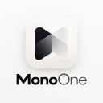

<p align="center">
  <a href="https://monoone-dev.github.io/surface-one">
    <picture>
      <source media="(prefers-color-scheme: dark)" srcset="packages/tokens/brand/surface-one-dark-mark.svg">
      
    </picture>
  </a>
</p>

<h1 align="center">SurfaceOne</h1>

<p align="center">
  Design system and component library — the one behind IndexOne — as packages any app can use.
</p>

<p align="center">
  <a href="https://monoone-dev.github.io/surface-one"><strong>Documentation</strong></a> ·
  <a href="https://monoone-dev.github.io/surface-one/storybook/">Storybook</a> ·
  <a href="CHANGELOG.md">Changelog</a> ·
  <a href="CONTRIBUTING.md">Contributing</a>
</p>

<p align="center">
  
  
</p>

---

| Package                                    | What it is                                                                                                                                                                               |
| ------------------------------------------ | ---------------------------------------------------------------------------------------------------------------------------------------------------------------------------------------- |
| [`@surface-one/tokens`](packages/tokens)   | Framework-agnostic CSS: design tokens, the Studio / Paper / Minimalist / Neumorphism / Material / Surface skins in light and dark, five accents, self-hosted latin + latin-ext fonts, brand marks. |
| [`@surface-one/angular`](packages/angular) | Angular 22 components with the `sone-` prefix — one secondary entry point per component (`@surface-one/angular/button`).                                                                 |
| [`@surface-one/vue`](packages/vue)         | Vue 3 and Nuxt components (`SoneButton`, `SoneCard`, …) with the same markup and stylesheets as the Angular ones, plus a Nuxt module (`@surface-one/vue/nuxt`).                          |

A React package is planned on top of the same tokens.

## Built on the shoulders of

SurfaceOne does not invent its component model — it deliberately follows three open-source
projects. Keep them in mind for every new component and every docs change:

| Project                                       | What we take from it                                                                                                                                                                                       |
| --------------------------------------------- | ---------------------------------------------------------------------------------------------------------------------------------------------------------------------------------------------------------- |
| [spartan/ui (ng-spartan)](https://spartan.ng) | The Angular anatomy: directive-first parts (`hlmBtn` → `soneBtn`, `hlmCard*` → `soneCard*`), inputs and their names, the brain/helm split of behaviour and styling.                                        |
| [shadcn/ui](https://ui.shadcn.com)            | The visual core: variants, sizes, spacing and the Nova / Vega / Maia styles our Minimalist, Studio and Paper skins are built on. Components are shadcn 1:1 with the base tokens.                           |
| [Nuxt UI](https://ui.nuxt.com)                | The documentation and catalogue: component categories (Layout, Element, Form, Data, Navigation, Overlay, Page, AI Chat, Editor), the Templates section, the MCP server and agent skills for AI assistants. |

Every component page in Storybook links its spartan/ui and shadcn/ui reference. When the three
disagree, follow spartan/ui for the Angular API, shadcn/ui for the look, and Nuxt UI for the docs.

## Install

```bash
npm install @surface-one/angular @surface-one/tokens
```

```jsonc
// angular.json → build.options
"styles": ["@surface-one/tokens", "@surface-one/angular/styles.css", "src/styles.css"]
```

```ts
import { SoneButtonDirective } from "@surface-one/angular/button";
```

```html
<button soneBtn variant="outline" type="button">Save</button>
```

### Vue and Nuxt

```bash
npm install @surface-one/vue @surface-one/tokens
```

```ts
// nuxt.config.ts — adds the CSS, auto-imports the Sone* components and v-sone-tooltip
export default defineNuxtConfig({ modules: ["@surface-one/vue/nuxt"] });
```

```vue
<SoneButton variant="outline" type="button">Save</SoneButton>
```

Plain Vue: `app.use(SurfaceOne)` and import `@surface-one/tokens` and
`@surface-one/vue/styles.css` — see [packages/vue](packages/vue).

### Install from GitHub Packages

Every release is also published to GitHub Packages. GitHub only accepts the repository owner's
scope there, so the packages are named `@monoone-dev/surface-one-*`; install them under npm aliases
and every `@surface-one/*` import keeps working.

```ini
# .npmrc — GitHub Packages needs a token even for public packages
# (a classic PAT with read:packages; in GitHub Actions, GITHUB_TOKEN with packages: read)
@monoone-dev:registry=https://npm.pkg.github.com
//npm.pkg.github.com/:_authToken=${GITHUB_TOKEN}
```

```bash
npm install @surface-one/angular@npm:@monoone-dev/surface-one-angular @surface-one/tokens@npm:@monoone-dev/surface-one-tokens
```

```jsonc
// package.json → dependencies (what the command above writes)
"@surface-one/angular": "npm:@monoone-dev/surface-one-angular@^0.1.0",
"@surface-one/tokens": "npm:@monoone-dev/surface-one-tokens@^0.1.0"
```

Alias `@surface-one/tokens` too: `@surface-one/angular` depends on it by that name. The AI tools
run the same way — `npx -y @monoone-dev/surface-one-angular-mcp@latest` and
`npx @monoone-dev/surface-one-skills add`.

## Documentation

- **Docs site** (`apps/docs`) — Home, Components, Guide, Theme, Templates and Changelog, in English,
  Polski, Español, Italiano, Français, Português, Deutsch, 简体中文 and 日本語. Fully prerendered for
  SEO, tested with axe-core in light and dark mode.
- **Storybook** — every component and token page; published under `/storybook/` of the docs site.

## AI assistants

- **MCP server** — `@surface-one/angular-mcp` gives Claude Code, Codex, Copilot, Cursor and Windsurf
  the component docs, API, source, styles, templates and theme variables:
  `claude mcp add surface-one-angular -- npx -y @surface-one/angular-mcp@latest`.
- **Agent skills** — `npx @surface-one/skills add` installs the SurfaceOne skills for Claude
  (`.claude/skills/`), Codex and GitHub Copilot (`.agents/skills/`).

See the Guide pages _MCP server_ and _Agent skills_ on the docs site.

## Develop

```bash
npm ci                 # installs and wires the git hooks
npm start              # docs on http://localhost:4200
npm run storybook      # Storybook on http://localhost:6006
npm run build:site     # tokens → library → docs (+ Storybook) into dist/docs/browser
npm run test:a11y      # axe-core over the built site
```

Branches, Conventional Commits and pull requests: see [`AGENTS.md`](AGENTS.md) and
[`CONTRIBUTING.md`](CONTRIBUTING.md). Code owners: @JakubGawr, @Lukas9315.

## License

[MIT](LICENSE) © MonoOne. The bundled fonts keep their own SIL Open Font License 1.1.

---

<p align="center">
  <a href="https://monoone.dev">
    
  </a>
  <br>
  <sub>Made by <a href="https://monoone.dev"><strong>MonoOne</strong></a> — small, private-by-default software for the Mac.</sub>
</p>
